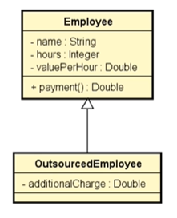
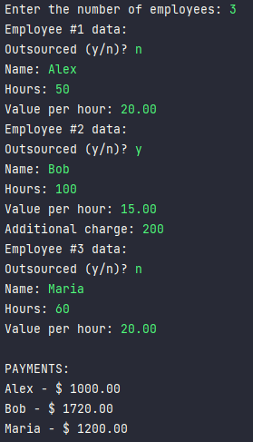

# About the project
A company has their own employees and outsourced employees.
 
We want to register the name, worked hours and value per
hour.
 
Outsourced employees have an additional charge.
 
The employee's payment corresponds the value per hour 
multiplied by worked hours, outsourced employees received 
a bonus correspondent to 110% of their additional charge.
 
Do a program that read data from N employees (input)
and store in a list.
After reading all the data, you have to show:  
- Name
- Payment according to every employee in the order of
input.

### Model
 

### Output
